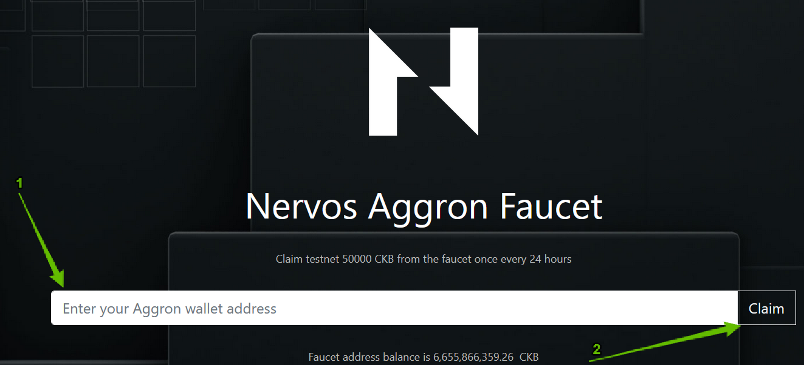
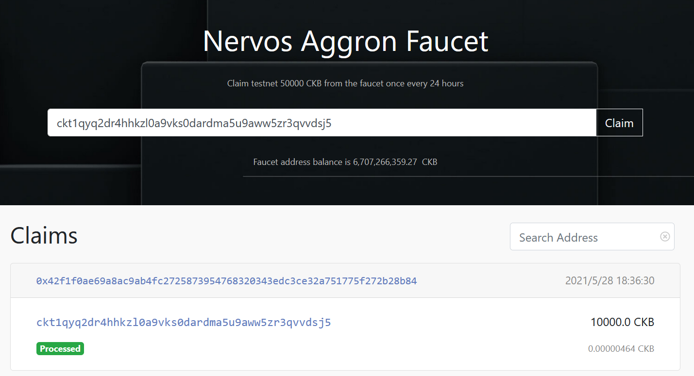
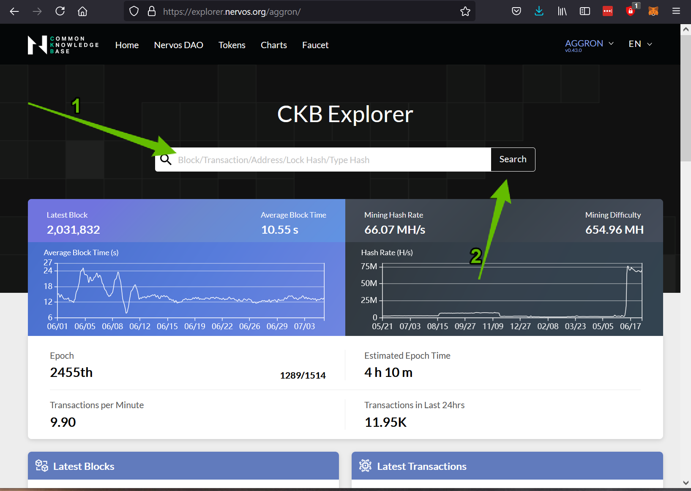
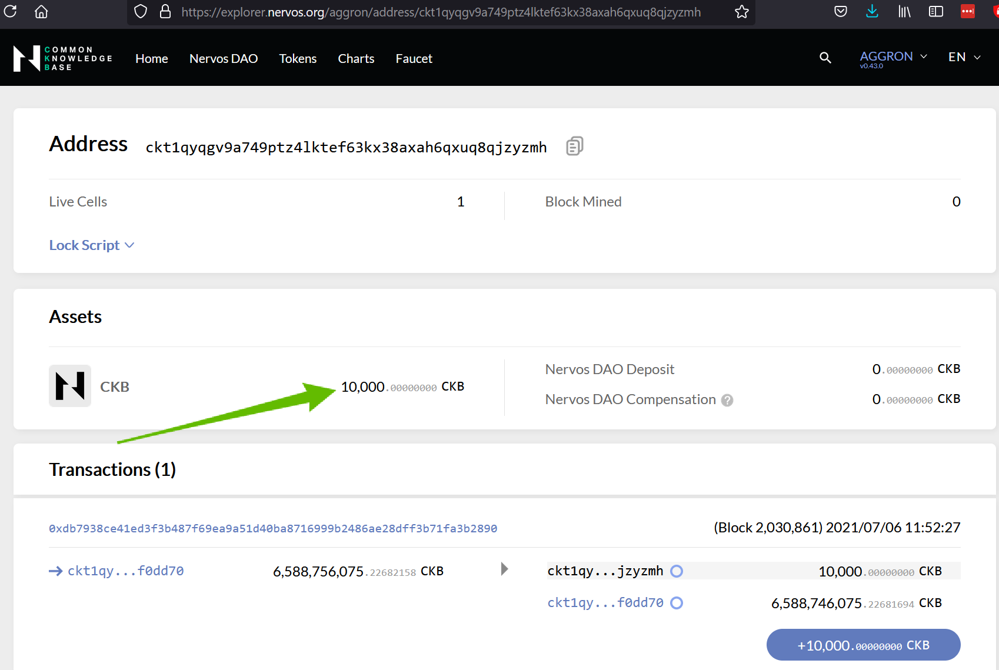
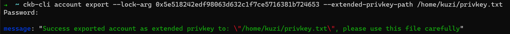

# Setup a Nervos CKB Layer 1 Account with CKBytes

### Introduction

Nervos Network is a multi-layer blockchain. Layer 1 is concerned with security and decentralization, while layer 2 is concerned with scalability. On Nervos, EVM compatibility is provided in a layer 2 execution environment which allows for high TPS throughput that inherits the security and decentralization of layer 1. These two layers work together to provide an optimally performant and safe environment for all users.

Our focus is on layer 2, but the process still begins on layer 1. We will start by creating an account on layer 1, funding it with some Testnet CKBytes, then exporting our private key so we can use it for the next step.

To create an account on layer 1 we will use the `ckb-cli` command-line tool. All of our examples use Linux.

### Install the ckb-cli Command Line Tool

> Note: If you have setup a locally running CKB Node, `ckb-cli` is included with it. You can optionally use this in place of the stand-alone installation.

The first thing we need to do is download and install the `ckb-cli` command line tool. Our instructions will install it the `projects` directory within the user's home folder.

Creating the `projects` directory is optional, but it may be helpful for organization since we will be installing more tools later. We will also be adding `ckb-cli` to the `PATH` so it can be used from any folder, but this is also purely optional.

Open a terminal and execute the commands below to create the `projects` folder, download the `ckb-cli` binary, and decompress it.

Commands for Linux:

```
mkdir -p ~/projects
cd ~/projects
curl -LO https://github.com/nervosnetwork/ckb-cli/releases/download/v0.101.3/ckb-cli_v0.101.3_x86_64-unknown-linux-gnu.tar.gz
tar xvzf ckb-cli_v0.101.3_x86_64-unknown-linux-gnu.tar.gz
mv ckb-cli_v0.101.3_x86_64-unknown-linux-gnu ckb-cli-0.101.3
```

Commands for MacOS:

```
mkdir -p ~/projects
cd ~/projects
curl -LO https://github.com/nervosnetwork/ckb-cli/releases/download/v0.101.3/ckb-cli_v0.101.3_x86_64-apple-darwin.zip
unzip ckb-cli_v0.101.3_x86_64-apple-darwin.zip
mv ckb-cli_v0.101.3_x86_64-apple-darwin ckb-cli-0.101.3
```

Commands for Windows (PowerShell):

```
New-Item -ItemType Directory -Force -Path ~/projects
cd ~/projects
Invoke-WebRequest https://github.com/nervosnetwork/ckb-cli/releases/download/v0.101.3/ckb-cli_v0.101.3_x86_64-pc-windows-msvc.zip -OutFile ckb-cli_v0.101.3_x86_64-pc-windows-msvc.zip
Expand-Archive .\ckb-cli_v0.101.3_x86_64-pc-windows-msvc.zip
New-Item -ItemType Directory -Force -Path .\ckb-cli-0.101.3
Get-ChildItem -Path .\ckb-cli_v0.101.3_x86_64-pc-windows-msvc\ckb-cli_v0.101.3_x86_64-pc-windows-msvc\ -Recurse -File | Move-Item -Destination ckb-cli-0.101.3
Get-ChildItem -Path .\ckb-cli_v0.101.3_x86_64-pc-windows-msvc\ -Recurse -Directory | Remove-Item
.\ckb-cli-0.101.3\ckb-cli.exe
```

The `ckb-cli` application should now exist in the `~/projects/ckb-cli-0.101.3` directory. You can execute it by running `~/projects/ckb-cli-0.101.3/ckb-cli` from any folder, or by running `./ckb-cli` if you are already in the `~/projects/ckb-cli-0.101.3` directory.

When you use `ckb-cli` it tries to connect to the local CKB node by default. If you are using a remote node, you must use the `--url` parameter to specify it.

Example usage and output:

```
~/ckb-cli-0.101.3$ ./ckb-cli --url http://3.235.223.161:18114

  _   _   ______   _____   __      __   ____     _____
 | \ | | |  ____| |  __ \  \ \    / /  / __ \   / ____|
 |  \| | | |__    | |__) |  \ \  / /  | |  | | | (___
 | . ` | |  __|   |  _  /    \ \/ /   | |  | |  \___ \
 | |\  | | |____  | | \ \     \  /    | |__| |  ____) |
 |_| \_| |______| |_|  \_\     \/      \____/  |_____/

[  ckb-cli version ]: 0.101.3 (1b66835 2021-10-20)
[              url ]: http://3.235.223.161:18114 (network: Testnet)
[              pwd ]: /home/username/projects/ckb-cli-0.101.3
[            color ]: true
[            debug ]: false
[          no-sync ]: false
[    output format ]: yaml
[ completion style ]: List
[       edit style ]: Emacs
[   index db state ]: Waiting for first query
CKB>
```

### Create a Layer 1 Account

The `ckb-cli` tool includes basic wallet functionality, and we will use it to generate an account with a CKB address.

Start `ckb-cli` using the following command:

```
./ckb-cli
```

Then following command to generate a new account:

```
account new
```

You will then be prompted to enter a password to secure your account. Be sure to pick a password that you're going to remember later on. Type password into the tool and press "Enter". Then repeat the password and press "Enter" again.

After the action is done you should see the output similar to this:

```
address:
  mainnet: ckb1qyq9u5vzgtklnqrr6cevra7w2utrsxmjgefsr0wk7q
  testnet: ckt1qyq9u5vzgtklnqrr6cevra7w2utrsxmjgefs72sfju
lock_arg: 0x5e518242edf98063d632c1f7ce5716381b724653
lock_hash: 0x5c7253696786b9eddd34e4f6b6e478ec5742bd36569ec60c1d0487480ba4f9e3
```

Nervos provides two types of addresses, one for use on the Mainnet, and another for use on the Testnet and also on Devnets. We will only be working with the Testnet address since we are working with the Testnet.

Make a note of the Testnet address and lock arg since these values will identify your account. We will need them in the next steps. Congratulations! You've just created your first Nervos account. 👏

The next step is to add funds to you Layer 1 account. You will need to get some free Testnet CKBytes so you can perform actions on Nervos.

We're done using `ckb-cli` for now, so you can type `exit` to quit.

> Note: If you see the message `Stop index thread timeout(state: Waiting for first query), give up`, you can safely ignore it.

### Get Free Testnet CKBytes from the Faucet

Open the Testnet Faucet in a web browser: [https://faucet.nervos.org/](https://faucet.nervos.org/)



Enter your wallet address from the previous step into the big "Enter your Aggron wallet address" input box. Make sure you use the Testnet address, not the Mainnet address. Your Testnet address begins with "ckt".

After you have provided your Testnet addres, click the "Claim" button and your transaction will be queued and enter a pending state. Under normal conditions, you should receive fund withing a few minutes.

Transaction is first in pending state:


Then it completes:



### Check Your Account Balance

Once the Faucet transaction has been processed, you should see an increased balance in your wallet.

To check the balance visit [Layer 1 Testnet Explorer website](https://explorer.nervos.org/aggron/). Then put your testnet address in the big input field below the "CKB Explorer" title. Then press "Search".



After a moment you should see the page with balance of your account.



If you see a balance, then your testnet funds are ready to use! 🍾

If you do not see a balance, try waiting a few more minutes, or try using the Testnet Faucet again later.

Tip: You can use the Testnet Faucet as many times as you need to, but it is rate limited to one request per address in a 24 hour period.

### Export Your Private Key

A private key is what grants access to you account and all the funds within it. Your private key should always remain a secret, and it should never be shared publicly since anyone with the private key can access anything on your account.

Some tools require the private key in order to access your account, and perform operations on your behalf. We will need to export our private key so that it can be provided to these tools.

We will use `ckb-cli` again to export the private key. The last time we used `ckb-cli` we used interactive mode. This time we will use it directly from the command line. Most of the functions of `ckb-cli` can be used both in interactive mode and from the command line.

To export your private key, use the `ckb-cli` command below, replacing values as needed. For MacOS users, your home folder should begin with `/Users`. eg: `/Users/<YOUR_USERNAME>/privkey.txt`

Linux/MacOS:

```
ckb-cli account export --lock-arg <YOUR_LOCK_ARG> --extended-privkey-path /home/<YOUR_USERNAME>/privkey.txt
```

Windows (PowerShell):

```
.\ckb-cli.exe account export --lock-arg <YOUR_LOCK_ARG> --extended-privkey-path C:\Users\<YOUR_USERNAME>\privkey.txt
```

* Replace `<YOUR_LOCK_ARG>` with the lock argument for your account. When you created account one of the values from output was `lock_arg`. Use it here. Example value: `0x5e518242edf98063d632c1f7ce5716381b724653`
* Replace `<YOUR_USERNAME>` with the name of the user on your machine to place the private key file in your home folder. You can also change the value of `--extended-privkey-path` if you would like to export private key to some other location.
* Some operating systems may use a different path for the user's home folder. You will need to adjust as necessary.

After you run the command above you will be asked for the password to your account. This is the password that you supplied when creating the account.

You should see a success message:

```
message: "Success exported account as extended privkey to: \"/home/<YOUR_USERNAME>/privkey.txt\", please use this file carefully"
```

Screenshot:



### View Your Private Key

After you have exported your private key file, you will still need to view it so you can copy it to the other applications where it is needed. You can do this using any text editor, but we will be using `cat` to dump the text to the contents of the private key file to the screen.

Using this command:

```
cat ~/privkey.txt
```

Results in:

```
79682c20bbcaf7fcf18eb0c69b133c872227ceb88971090e7f2242c80cd54d18
f8a4586790460d7cd8eb389af4cd1b0cfc9903b5d4b88b9eedb8fb9c150c4c88
```

Note: If you see a `%` at the end, ignore it. It just marks the end of file.

The first line of this file is your private key. To use it with applications we need to copy it from this file, and **add the '0x' prefix to mark it as hex string**.

The second line in the file is chain code for the BIP44 standard, but we will not use this so it can be safely ignored.

Our final private key is below:

```
0x79682c20bbcaf7fcf18eb0c69b133c872227ceb88971090e7f2242c80cd54d18
```

Congratulations, you're ready to use it with other apps! 👏 Copy do this private key so you have it somewhere that it can be used later.
