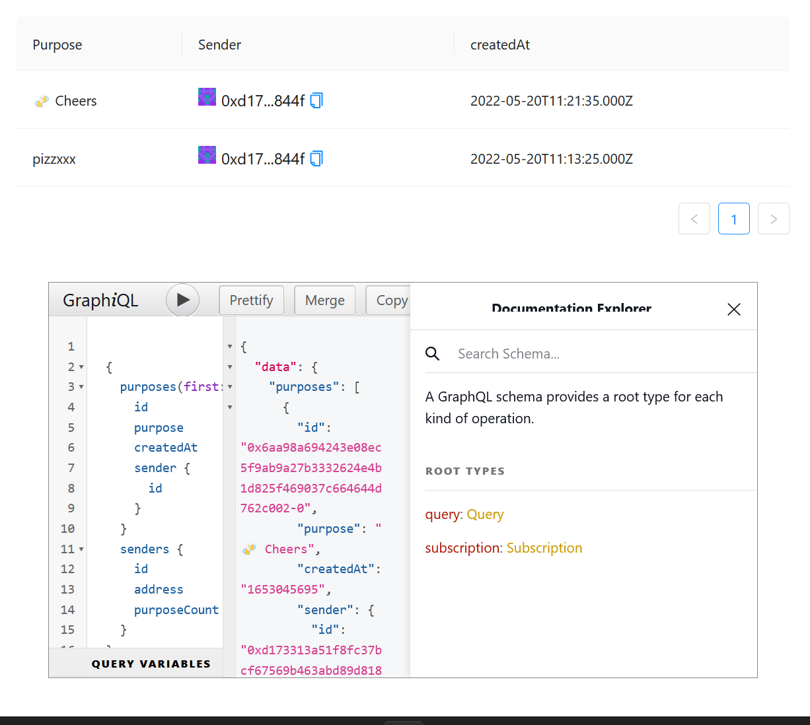

# Project Templates

## Scaffold Eth

.png>)

Clone:

```
git clone https://github.com/nervosnetwork/scaffold-eth
```

Create .env file based on .sample.env and uncomment provider URL in packages/react-app:

```
REACT_APP_PROVIDER=https://godwoken-testnet-v1.ckbapp.dev
```

Install and start your 📱 frontend:

```
yarn
yarn start
```

In a second terminal window, deploy your contract to testnet:

```
yarn deploy --network godwoken
```

### Indexer

In a third terminal window, start graph-node (requires Docker):

```
yarn run-graph-node
```

Then in other terminal window create and deploy subgraph:

```
yarn graph-create-local
yarn graph-ship-local
```

Your events should be shown now after blockchain transactions are confirmed:


