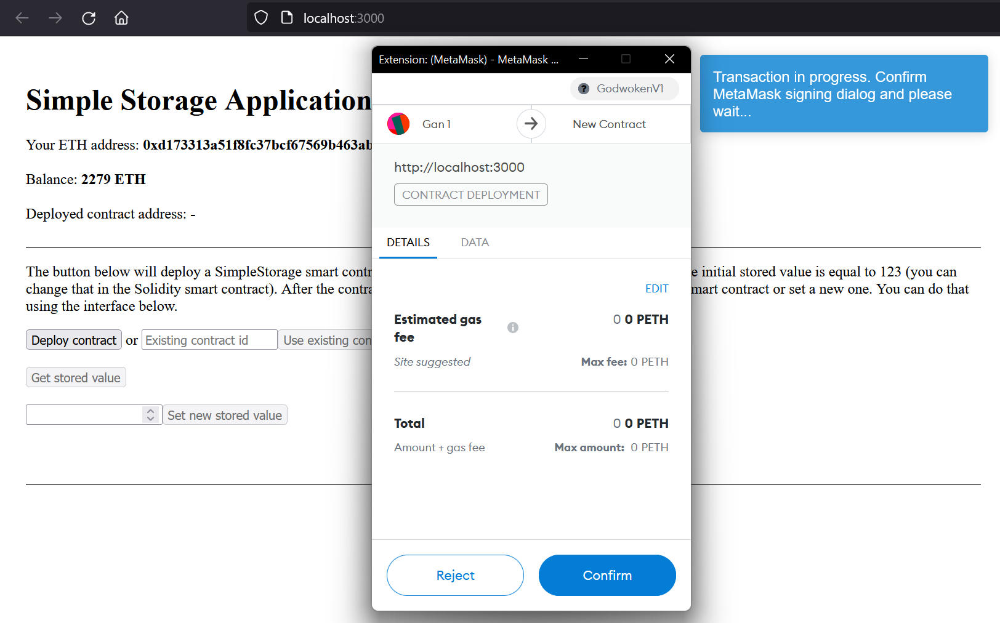

# 5. Port an Existing Ethereum dApp to Polyjuice

In this tutorial you will learn how to port an existing browser Ethereum application to run on Nervos' EVM compatible [Layer 2](../concept-explainers/structure.md#layer-1-layer-2).

[MetaMask](../concept-explainers/wallets.md#metamask) is the primary method of interacting with dApps on Nervos. The overall user experience will be very similar to existing Ethereum.

## Task Instructions

In this task, you will need to port over an existing Ethereum dApp to Nervos' Layer 2. Our examples will use the Simple Storage smart contract. Our general suggestion is that you take an existing Ethereum dApp that you are already familiar with, then make the changes required to port it to Nervos.

In this guide we assume you have application that is using **Ethers.js**.

### Prerequisites

Your MetaMask wallet should be installed and configured with the same Ethereum accounts from the previous tasks. Your MetaMask Ethereum account should still be funded on Layer 2 from the previous tasks.

### 1. Setup the Godwoken Testnet Network in MetaMask

Your MetaMask wallet will need to be configured to communicate with the Godwoken Layer 2 network. To do this, you will need to configure a new custom RPC. From the network selection dropdown, select "Custom RPC".


From there you will be presented with a form to specify the network settings.


Enter the following details.

```
Network Name: Godwoken Testnet
RPC URL: https://godwoken-testnet-v1.ckbapp.dev
Chain ID: 71401
Currency Symbol: pCKB
Block Explorer URL: <Leave Empty>
```

After MetaMask is configured you may see a zero balance even after you have deposited funds into this Ethereum address on Layer 2. Don't be alarmed by this. Later on we will show you how to setup your application to call `provider.getBalance()` with your Ethereum address to query for your balance.

### 2. View the Ethereum Demo Application

A simple Ethereum demo application has been built to use the Simple Storage to read and write number values. We will walk through this Ethereum application, and demonstrate the changes needed to make this run on Nervos' Layer 2.

Follow along with our explanations so you become familiar with the process invovled in porting an application.

First, we need to clone the repo. This contains the Ethereum version of the application before it has been updated to support Godwoken.

Create `~/projects` directory if it doesn't exist.

Linux/MacOS:

```
mkdir -p ~/projects
```

Windows (PowerShell):

```
New-Item -ItemType Directory -Force -Path ~/projects
```

Enter the `~/projects` directory and clone the repository.

```
cd ~/projects
git clone https://github.com/Kuzirashi/blockchain-workshop.git -b ethereum-simple blockchain-workshop-ethereum-simple
cd blockchain-workshop-ethereum-simple
```

Next, install the dependencies, build the smart contracts, and start Hardhat node to run a local Ethereum development chain.

```
cd ~/projects/blockchain-workshop-ethereum-simple
yarn
yarn build
yarn start:ethereum
```

Hardhat node should now be running and creating blocks.

Switch back to your web browser. Open MetaMask and switch your network to `Localhost 8545`. It should switch and connect without giving an error now that Hardhat local network is running.


In a second terminal, start the UI server.

```
cd ~/projects/blockchain-workshop-ethereum-simple
yarn ui
```

The server should now be started, and you can open a browser tab to [http://localhost:3000](http://localhost:3000) to view the dApp UI!


> If you are testing the application on Ethereum Hardhat and you see an error: "Trying to send a raw transaction with an invalid chainId. The expected chainId is ..." go to Network settings in MetaMask for localhost:8545 and update the chain id.

### 3. Change network in MetaMask to Godwoken

To make this specific application working on Godwoken network you only have to change network in MetaMask to Godwoken.

The application is using MetaMask provider so it should automatically change to deploy contract and send transactions on Godwoken network.



### 4. Set High Gas Limit

Godwoken requires the gas limit to be set when sending transactions. This may not always be the case in the future, but it is a requirement for the current version on the Testnet. Make sure you set gas limit when sending transaction on Godwoken network, eg.:

```
async setStoredValue(value: number) {
    return this.contract.set(value, {
        gasLimit: 1000000
    });
}
```

### Potential Errors and Solutions

* You might need to wait for MetaMask confirmation that your transaction has been included in a block before interacting with contract. It can take about a minute.
* If you get a CORS error in your web browser's console, try searching your code for a Godwoken RPC URL that is **not** using `https`. Change any instances of `http://godwoken-testnet-v1.ckbapp.dev` to `https://godwoken-testnet-v1.ckbapp.dev`.
* There are a number of small differences that can potentially impact your application and cause problems if you're not aware of them. A list of these differences can be found [here](https://github.com/nervosnetwork/godwoken-polyjuice/blob/main/docs/EVM-compatible.md).
